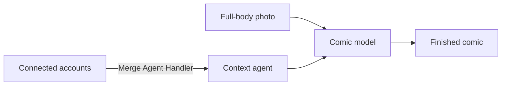

# Toonback

**Your life, drawn.**

Toonback turns the scattered details of your digital life into a personal comic.

Connect the services you already use, choose how far back to look, upload a full-body photo, and press one button. Toonback finds the moments that make your life yours and returns a funny, warm comic starring you.

## How it works

1. Connect your personal accounts.
2. Upload a full-body photo.
3. Press **Create my comic**.
4. Download, share, or generate another comic.

The finished comic keeps the same cartoon character and visual style across every panel.

## Merge integration

[Merge Agent Handler](https://www.merge.dev/merge-agent-handler) connects Toonback to the services that contain the user's story:

- Google Calendar and Outlook for plans and events
- Gmail for conversations and life updates
- Spotify for music and mood
- Oura and WHOOP for sleep and activity
- Notion and Google Tasks for thoughts and plans
- GitHub, Canva, and Figma for projects and creative work

Users authorize each service they want to include. Merge handles authentication, credentials, token refresh, and tool access through a single integration.

Toonback gives its context agent a curated set of read-only tools from the connected services. The agent collects relevant moments from the chosen chapter of your life, removes sensitive details, and sends the resulting context and character photo to the comic-generation model.

## Architecture

## Tech stack

- Next.js
- TypeScript
- Vercel AI SDK
- Merge Agent Handler and Merge Link
- Vercel
- Vercel Blob for shared comics

## Privacy

Toonback uses personal context and the uploaded photo only while generating the comic. It does not permanently store either.

Generated comics remain temporary until the user creates a share link. Toonback then uploads only the finished comic to Vercel Blob. Anyone with the link can view it.

## Hackathon

Built for the Corgi × Merge × Vercel **Make It Feel Human** hackathon.
