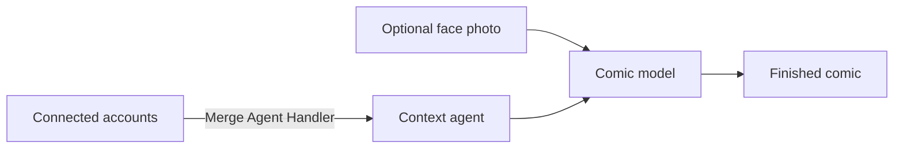

# Toonback

**Your life, drawn.**

Toonback turns the scattered details of your digital life into a personal comic.

Connect the services you already use, choose the last week, last month, or your lifetime, and press one button. Optionally add a face photo so the comic stars a cartoon version of you.

## How it works

1. Connect your personal accounts.
2. Optionally upload a clear face photo.
3. Choose **Last week**, **Last month**, or **Lifetime**.
4. Press **Create my comic**.
5. Download, share, or generate another comic.

The finished comic keeps the same cartoon character and visual style across every panel.

## Duo comics

To make a comic with someone else, send them the room invitation link shown during setup. They connect their own accounts and can optionally add their face. Toonback then looks across both people's context for shared moments, contrasts, and places where their lives collide.

## Merge integration

[Merge Agent Handler](https://www.merge.dev/merge-agent-handler) connects Toonback to the services that contain the user's story:

- Gmail for conversations and life updates
- Google Calendar for plans and events
- Google Drive for files and documents
- Spotify for music and mood
- X for posts and activity

Users authorize each service they want to include. Merge handles authentication, credentials, token refresh, and tool access through a single integration.

On local macOS development, Toonback can also read iMessage directly with the user's permission. Users may add text or files as context without connecting another service.

Toonback gives its context agent a curated set of read-only tools from the connected services. The agent collects relevant moments from the chosen chapter of your life, removes sensitive details, and sends the resulting context and character photo to the comic-generation model.

## Architecture

## Tech stack

- Next.js
- TypeScript
- Merge Agent Handler and Merge Link
- Vercel
- Vercel Blob for shared comics

## Privacy

Toonback uses personal context and the uploaded photo only while generating the comic. It does not permanently store either.

Generated comics remain temporary until the user creates a share link. Toonback then uploads only the finished comic to private Vercel Blob storage and creates an unguessable public link. Anyone with the link can view it.

## Hackathon

Built for the Corgi × Merge × Vercel **Make It Feel Human** hackathon.
